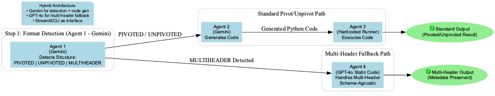

# 🔄 Excel Data Transformer
A comprehensive, AI-powered data transformation system that automatically detects Excel file formats and transforms them between different data structures. The system supports three main format types and uses a modular agent-based architecture for intelligent data processing.

# 💡 The Genesis of the Project
This project was born out of a real-world challenge faced during my AI research internship at an NGO dedicated to educating deaf and mute undergraduate students. The workflow for tracking student performance involved teachers entering marks into multi-header Google Sheets. This data then had to be manually processed with Google Scripts and validated by hand before it could be used in BI dashboards like Looker Studio, which struggle to interpret complex, multi-level data structures.

The process was slow, prone to errors, and required significant manual oversight. My role was to explore a more intelligent, automated solution. The central question was: Can we leverage AI to autonomously understand these complex data structures and generate the Python code needed to transform them into a clean, analysis-ready format?

This repository is the answer. It is a multi-agent system that uses extensive prompt engineering and a hybrid AI architecture to automate the entire data transformation pipeline, replacing a brittle, manual process with a robust and intelligent one.

# System Architecture Diagram


# 🔬 Full Research Report & Methodology
This project is the outcome of 29 systematic experiments that evaluated the capabilities and limitations of using Large Language Models for complex data transformation. For a deep dive into the step-by-step process, prompt engineering strategies, and findings, you can view the full research report.

# [➡️ Click here to View the Full Research Report ](https://drive.google.com/file/d/1zblBziEYtKcOHQTAqcyY15_vINJcJDhT/view?usp=share_link)

## 🎯 Supported Transformations

### 1. **PIVOTED ↔ UNPIVOTED** (Agent-based)
- **PIVOTED → UNPIVOTED**: Converts wide-format data (multiple columns per entity) to long-format (multiple rows per entity)
- **UNPIVOTED → PIVOTED**: Converts long-format data to wide-format using intelligent column detection

### 2. **MULTIHEADER → LONG** (Direct conversion)
- Handles complex Excel files with stacked/hierarchical headers
- Automatically flattens multi-level headers into a clean, long-format structure
- Preserves metadata relationships from header levels

## 🧠 System Architecture

### **Agent 1: Format Detection** (`agent1_detection_prompt.txt`)
- Analyzes Excel file structure using AI
- Classifies data as `PIVOTED`, `UNPIVOTED`, or `MULTIHEADER`
- Uses intelligent heuristics to determine data format

### **Agent 2: Code Generation** (`agent2_codegen_prompt.txt`)
- Generates dynamic Python/pandas code for PIVOTED ↔ UNPIVOTED transformations
- Uses Google Gemini 2.0 Flash for intelligent code generation
- Handles column inference and data type detection automatically

### **Agent 3: Code Execution** (`agent3_executor.py`)
- Safely executes generated transformation code
- Provides error handling and validation
- Routes MULTIHEADER files to Agent 4

### **Agent 4: Multi-header Processing** (`agent4_code.py`)
- Direct conversion for complex multi-header Excel files
- Handles stacked headers and metadata preservation
- No AI dependency - deterministic processing

## 🚀 Features

- **🎯 Intelligent Format Detection**: Automatically identifies data structure
- **🤖 AI-Powered Transformations**: Dynamic code generation for complex transformations
- **📊 Multi-Header Support**: Handles complex Excel files with stacked headers
- **🛡️ Error Handling**: Comprehensive validation and error reporting
- **📱 Web Interface**: User-friendly Streamlit UI for file upload/download
- **☁️ Cloud Deployment**: Ready for Render.com deployment
- **🔧 Local Development**: Easy setup for local testing

## 🛠️ Installation & Setup

### Prerequisites
- Python 3.8+
- Google Generative AI API key

### Local Development

1. **Clone and setup environment:**
```bash
git clone <repository-url>
cd "Data transformer"
```

2. **Install dependencies:**
```bash
# Option 1: Using requirements.txt
pip install -r requirements.txt

# Option 2: Using setup script
chmod +x setup_env.sh
./setup_env.sh
```

3. **Configure API key:**
```bash
# Add your Gemini API key to gemini_key.txt
echo "your_gemini_api_key_here" > gemini_key.txt
```

4. **Run the application:**
```bash
streamlit run ui_streamlit_app.py
```

### Environment Variables
- `GEMINI_API_KEY`: Your Google Generative AI API key (for cloud deployment)

## 🌐 Cloud Deployment

### Render.com Deployment

1. **Push to GitHub** with the following structure:
```
Data transformer/
├── ui_streamlit_app.py
├── agent1_detection_prompt.txt
├── agent2_codegen_prompt.txt
├── agent3_executor.py
├── agent4_code.py
├── requirements.txt
├── render.yaml
└── gemini_key.txt
```

2. **Create Web Service** on Render.com:
   - Connect your GitHub repository
   - Set **Start Command**: `streamlit run ui_streamlit_app.py`
   - Add environment variable: `GEMINI_API_KEY`

3. **Deploy** and access your web application

### Alternative: Manual Render Setup
Use the `render.yaml` configuration file for automatic deployment setup.

## 📁 Project Structure

```
Data transformer/
├── 📄 ui_streamlit_app.py              # Main Streamlit web interface
├── 🤖 agent1_detection_prompt.txt      # AI prompt for format detection
├── 🤖 agent2_codegen_prompt.txt        # AI prompt for code generation
├── ⚙️ agent3_executor.py               # Code execution engine
├── 🔧 agent4_code.py                   # Multi-header converter
├── 📦 requirements.txt                 # Python dependencies
├── 🚀 render.yaml                      # Render deployment config
├── 🔑 gemini_key.txt                   # API key storage
├── ⚙️ setup_env.sh                     # Environment setup script
```

## 🔧 Dependencies

- **pandas** (≥2.2): Data manipulation and Excel I/O
- **streamlit** (≥1.34): Web interface framework
- **google-generativeai** (≥0.4): Gemini AI integration
- **openpyxl** (≥3.1): Excel file processing
- **python-dotenv** (≥1.0): Environment variable management

## 📊 Usage Examples

### 1. PIVOTED → UNPIVOTED
**Input**: Wide format with multiple columns per entity
```
ID  | Math | Science | English
1   | 85   | 90      | 88
2   | 92   | 87      | 91
```

**Output**: Long format with multiple rows per entity
```
ID  | Subject  | Score
1   | Math     | 85
1   | Science  | 90
1   | English  | 88
2   | Math     | 92
2   | Science  | 87
2   | English  | 91
```

### 2. MULTIHEADER → LONG
**Input**: Complex Excel with stacked headers
```
        | Test 1 | Test 1 | Test 2 | Test 2
        | Math   | Science| Math   | Science
Student | Score  | Score  | Score  | Score
John    | 85     | 90     | 88     | 92
```

**Output**: Clean long format with metadata
```
Student | Subject | Test | Score
John    | Math    | 1    | 85
John    | Science | 1    | 90
John    | Math    | 2    | 88
John    | Science | 2    | 92
```

## 🔍 How It Works

1. **Upload**: User uploads Excel file via Streamlit interface
2. **Detection**: Agent 1 analyzes file structure and classifies format
3. **Routing**: 
   - **MULTIHEADER** → Direct conversion via Agent 4
   - **PIVOTED/UNPIVOTED** → AI code generation via Agent 2
4. **Execution**: Agent 3 runs transformation code or calls Agent 4
5. **Output**: Transformed Excel file available for download

## 🛡️ Error Handling

- **File Validation**: Checks for valid Excel format
- **Format Classification**: Validates detected format type
- **Code Execution**: Safe execution with comprehensive error reporting
- **Data Validation**: Ensures output is valid DataFrame

## 🔮 Future Enhancements

- Support for additional data formats (CSV, JSON)
- Custom transformation rules
- Batch processing capabilities
- Advanced data validation
- Integration with cloud storage services

## 📝 License

This project is licensed under the MIT License - see the [LICENSE](LICENSE) file for details.


## 🤝 Contributing

1. Fork the repository
2. Create a feature branch
3. Make your changes
4. Test thoroughly with sample data
5. Submit a pull request

---

**Built using Streamlit, Pandas, and Google Gemini AI**

